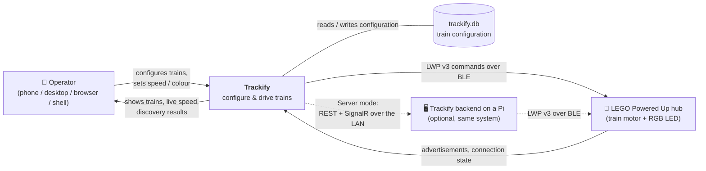
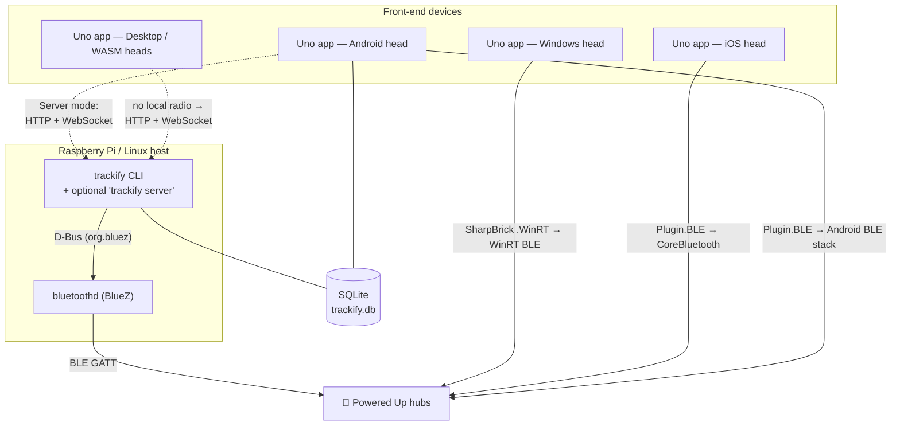

# 3. Context and Scope

## 3.1 Business Context

Trackify sits between a person who wants to run model trains and the LEGO hubs that actually move
them. Everything else in the picture is either storage it owns or a radio stack it borrows.

| Partner | Direction | What is exchanged |
|---|---|---|
| **Operator** | in / out | Train configuration (name, hub type, ports, colour, speed, accel/brake curves), track layout, live speed and LED commands; back: train list, discovery results, live speed, connection status |
| **LEGO Powered Up hub** | in / out | Out: LWP v3 `StartPower` (motor) and `SetRgbColor` (LED) messages. In: BLE advertisements (device id, MAC, manufacturer data → hub type), connection/services-resolved state |
| **Train store (`trackify.db`)** | in / out | The persisted `Train` rows — the single shared configuration between the app and the CLI |
| **Trackify backend** (Server mode only) | in / out | The same use-cases over the network: REST for one-shot actions, SignalR for real-time speed/LED and `SpeedChanged` broadcasts |

Note that the backend is **not a third party** — it is the same Trackify code, deployed on a machine
that happens to own the radio. It is drawn here because from the app's point of view it is an
external system reached over a network.

## 3.2 Technical Context

### Technical interfaces

| Interface | Protocol / technology | Used by | Defined in |
|---|---|---|---|
| **Hub control** | LWP v3 over BLE GATT (`StartPower`, `SetRgbColor`) | every transport | `Infrastructure/Ble/LwpCommands.cs`, `Application/Lego/LwpAddressing.cs` (pure parts) |
| **Hub discovery** | BLE advertisements; manufacturer data identifies the hub type | every transport | `ILegoService.DiscoverAsync` → `DiscoveredHubDto` |
| **Android/iOS radio** | Plugin.BLE 3.0.0 → SharpBrick `.Mobile` | `DirectLegoService` | `Application/Services/` |
| **Windows radio** | WinRT Bluetooth → SharpBrick `.WinRT` | `WindowsLegoService` | `Application/Services/` |
| **Linux radio** | D-Bus to `org.bluez` via `Linux.Bluetooth` | `BlueZLegoService` | `Infrastructure/Ble/` |
| **Persistence** | EF Core → SQLite file; enums stored as readable names | `SqliteTrainRepository` | `Infrastructure/Persistence/` |
| **REST (one-shot actions)** | HTTP/JSON — `GET /api/trains`, `POST /api/discover`, `POST /api/hubs/{hubId}/connect`, `.../disconnect`, `GET /api/state` | server ↔ Refit client | `Application/Remote/ApiRoutes.cs` (shared by both sides) |
| **Real-time control** | SignalR over WebSocket at `/hubs/trains` — client→server `SetSpeed`/`SetLed`/`Stop`, server→client `SpeedChanged` | server ↔ SignalR client | `Application/Remote/TrainHubMethods.cs` (shared by both sides) |
| **CLI** | argv via Spectre.Console.Cli: `discover`, `list`, `connect`, `drive`, `stop`, `color`, `auto`, `server` | operator | `Cli/Program.cs`, `Cli/Commands/` |
| **Process control** | SIGINT / Ctrl+C → cooperative cancellation → stop motors, disconnect | systemd, Docker, terminal | `Cli/Extensions/ConsoleCancellation.cs` |
| **Configuration** | `appsettings.json` + environment variables; `TRACKIFY_STORE` overrides the database path | CLI, backend, app | `Cli/appsettings.json`, `Infrastructure/DependencyInjection.cs` |

### Interface ownership

`ApiRoutes` and `TrainHubMethods` live in **`Trackify.Application`**, not in the CLI and not in the
app. Both sides of the network boundary compile against the same constants, so a renamed route is a
compile error rather than a runtime 404 — see
[ADR-08](09-architecture-decisions.md#adr-08-rest-for-one-shot-actions-signalr-for-real-time-control).

## 3.3 System boundary

**Inside** the boundary: the domain model and speed maths, use-cases, the four BLE transports, the
SQLite store, the two front-ends, and the LAN backend.

**Outside**: the hubs themselves and their firmware; the OS Bluetooth stacks (Android/CoreBluetooth/
WinRT/BlueZ); the LEGO protocol specification; SQLite; and the network between an app in Server mode
and the backend.

Trackify makes **no outbound internet calls at runtime** — no telemetry, no update check, no cloud.
