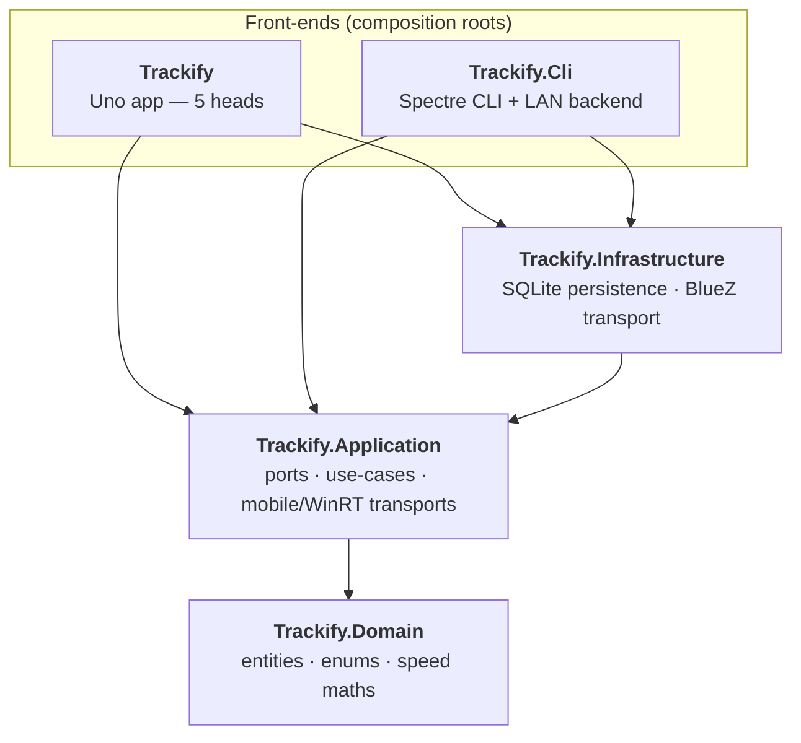
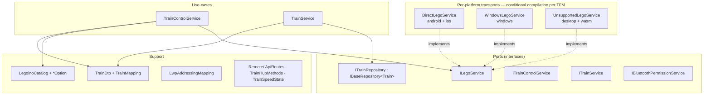
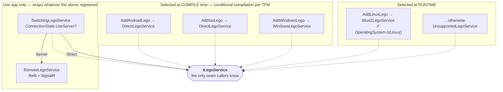

# 5. Building Block View

## 5.1 Level 1 — Whitebox: Trackify

> **Why do the front-ends reference Infrastructure?** Only at the composition root, to wire concrete
> implementations into DI (`AddTrackifyInfrastructure()`). Both the app and the CLI need the SQLite
> store, so both take the reference — and both consequently inherit the `NU1903` suppression for the
> transitive `Tmds.DBus` advisory ([§11](11-risks-and-technical-debt.md)). No front-end *type* depends
> on an Infrastructure type; the arch tests guard the direction that matters.

| Building block | Responsibility | Must not |
|---|---|---|
| `Trackify.Domain` | The persisted, transport-agnostic model (`Train`, `TrackSegment`, `BaseEntity`), all enums, and pure speed-profile maths (`SpeedFunction`, `ExpressionParser`) | Know about UI, logging, EF Core, BLE, or any other layer |
| `Trackify.Application` | Ports (`ILegoService`, `ITrainRepository`, `ITrainControlService`, `ITrainService`, `IBluetoothPermissionService`), use-cases, `TrainDto` + mapping, the LEGO catalog, the shared network contract, **and** the Android/iOS/Windows BLE transports | Reference Infrastructure, a front-end, or EF Core |
| `Trackify.Infrastructure` | EF Core + SQLite repository (`BaseRepository<T>` → `SqliteTrainRepository`) and the BlueZ/Linux transport | Reference a front-end |
| `Trackify` (Uno app) | Presentation: pages, view models, converters, behaviors, widgets; Android permission glue; the Direct/Server switch and the remote transport | Contain business logic, or touch `Trackify.Domain.Trains` entities directly |
| `Trackify.Cli` | argv parsing, console rendering, the auto-pilot loop, and the ASP.NET Core backend host | Touch `Trackify.Domain.Trains` (arch-test enforced) |
| `Trackify.Tests` | xUnit tests foldered by layer + the architecture rules | — |

## 5.2 Level 2 — Inside each layer

### 5.2.1 Trackify.Domain

| Element | Purpose |
|---|---|
| `Common/BaseEntity` | `record` base: GUID v7 `Id`, `DateCreated`/`DateUpdated` as Unix ms |
| `Trains/Train` | The persisted train configuration: name, `HubType`, `BleAddress`, `HubId`, LED colour, port A/B device types, speed, accel/brake function + custom expression, `IsActive`. Runtime state (connected? status text) is deliberately absent |
| `Trains/TrackSegment` | Per-segment configuration: type, max speed, direction, accel/brake functions, sensor + sensor action, slow target. Geometry and labels belong to presentation |
| `Enums/*` | `HubType`, `DeviceType`, `LedColorType`, `SegmentType`, `SensorType`, `SensorActionType`, `SpeedFunctionType`, `TrackDirection`, `TrainFilterType` — one file each |
| `SpeedFunction` | `Evaluate(type, x)` for the built-in curves; `TryCompile` for user formulas (validated at x = 0, 0.5, 1 — rejects NaN/∞); `ResolvePhaseFunction` falls back to identity when a custom formula is invalid |
| `ExpressionParser` | Recursive-descent parser for user-entered `f(x)` over `+ - * / ^`, `sin/cos/sqrt/exp`, `pi` |

The only package reference is `Microsoft.Extensions.DependencyInjection.Abstractions`, purely so the
layer can expose its own `AddTrackifyDomain()` entry point for symmetry.

### 5.2.2 Trackify.Application

| Element | Purpose |
|---|---|
| `ILegoService` | The BLE seam. `IsSupported`, `DiscoverAsync`, `Connect/DisconnectAsync`, `SetSpeedAsync(hubId, port, power)`, `SetLedAsync(hubId, r, g, b)`. Power is a percentage: 1..100 forward, −1..−100 reverse, 0 = float-stop, 127 = brake-stop |
| `TrainControlService` | The shared control use-case over a `TrainDto`. Owns `MotorPort = 0` (port A), the 200 ms per-hub speed debounce, hub-key resolution (`HubId` → `BleAddress`), `IsSameDevice` matching, and hex→RGB conversion for the LED |
| `TrainService` | Train CRUD over `ITrainRepository`, including saving a discovered hub onto a train |
| `IBaseRepository<T>` / `ITrainRepository` | Generic CRUD contract (`GetById/GetAll/Find/Add/AddRange/Update/Delete`); the per-entity port adds nothing yet |
| `TrainDto` + `TrainMapping` | The front-end-facing shape and its entity mapping — the DTO boundary ([ADR-07](09-architecture-decisions.md#adr-07-front-ends-see-traindto-never-domain-entities)) |
| `Catalog/LegoinoCatalog` + `*Option` | The LEGO reference tables: hubs, devices, colours (with hex), directions, sensors, speed functions. One file per option record |
| `Lego/LwpAddressingMapping` | The genuinely pure LWP bits: RGB-LED port table, MAC format/parse |
| `Remote/` | The network contract shared by server and client: `ApiRoutes`, `TrainHubMethods`, `TrainSpeedState` |
| `Services/DirectLegoService` | Android/iOS transport over SharpBrick `.Mobile` / Plugin.BLE |
| `Services/WindowsLegoService` | Windows transport over SharpBrick `.WinRT` |
| `Services/UnsupportedLegoService` | Honest no-op for heads without a radio (`IsSupported => false`) |

**Multi-targeting.** This project's TFM list depends on the **build host**: Windows adds
`net10.0-android` + `net10.0-windows…`, macOS adds `net10.0-android` + `net10.0-ios`, Linux stays at
plain `net10.0;net9.0`. A desktop/server RID publish (e.g. `-r linux-arm64`) is detected and forced
back to the transport-free TFMs, or NuGet would try to restore a nonexistent Mono runtime pack
(`NU1102`). → [ADR-05](09-architecture-decisions.md#adr-05-host-conditioned-multi-targeting-of-trackifyapplication)

### 5.2.3 Trackify.Infrastructure

| Element | Purpose |
|---|---|
| `Persistence/TrackifyDbContext` | EF Core context; enums are stored as readable names; schema created via `EnsureCreated()` (no migrations) |
| `Persistence/BaseRepository<T>` | Default EF CRUD over an `IDbContextFactory` |
| `Persistence/SqliteTrainRepository` | `ITrainRepository` implementation; adds only `DefaultDatabasePath()` (`~/.config/Trackify/trackify.db` / `%APPDATA%\Trackify\trackify.db`) |
| `Ble/BlueZLegoService` | The Linux `ILegoService`. Awaits `adapter.EnsureReadyAsync()` **before** starting a scan, because SharpBrick's `Discover()` is fire-and-forget and would swallow a radio-off error |
| `Ble/BlueZPoweredUpBluetoothAdapter` | The SharpBrick adapter over `Linux.Bluetooth`: powers the radio on, sets an **LE** discovery filter, and enumerates already-cached devices at scan start |
| `Ble/BlueZDevice`, `BlueZService`, `BlueZCharacteristic`, `BlueZDeviceInfo` | Thin GATT wrappers. `BlueZDevice` waits for `ServicesResolved = true`, not merely `Connected` — GATT lookups race and return null otherwise |
| `Ble/LwpCommands` | Builds SharpBrick typed messages (`StartPower`, `SetRgbColor`) and the bounded connect-with-retry. **Not pure** — that is why it lives here and not in Domain |
| `Ble/LinuxLegoServiceExtensions` | `AddLinuxLego()` — the **runtime** `OperatingSystem.IsLinux()` check; registers the concrete adapter as a singleton *and* forwards `IPoweredUpBluetoothAdapter` to the same instance so SharpBrick and the service share one radio |

### 5.2.4 Trackify (Uno app)

| Folder | Contents |
|---|---|
| `Presentation/Pages` | `Shell`, `MainPage` (responsive master–detail — the one allowed code-behind), `SecondPage` |
| `Presentation/Components` | Page-specific sections inheriting the page `DataContext`: `TrainListPanel`, `TrainEditor`, `TrackCanvas`, `SegmentInspector`, `AddHubDialog` |
| `Presentation/Widgets` | Reusable atoms with `DependencyProperty`s — `SpeedProfileWidget.Graph` |
| `Presentation/ViewModels` | `MainViewModel` (+ `.Hub` partial), `ShellViewModel`, `SecondViewModel`, small item VMs |
| `Presentation/Converters` / `Behaviors` | Nine converters registered once in `Styles/Converters.xaml`; `TappedCommandBehavior` instead of event handlers |
| `Helpers` | `SpeedCurve` → `SpeedProfileGraph` (presentation-only SVG path data), `TrackGeometry` |
| `Models/Trains` | `Train`/`TrackSegment` as `ObservableObject` view models |
| `Services/Remote` | `ConnectionState`, `SwitchingLegoService`, `RemoteLegoService`, `ITrackifyApi` (Refit), `TrackifyApiFactory`, `RemoteServerOptions`, `RemoteTrainSync` |
| `Services` | `AndroidBluetoothPermissionService` (needs the `Activity`, so it cannot live in Application) |
| `Platforms` | Per-head entry points; exempt from the namespace-matches-folder rule |

### 5.2.5 Trackify.Cli

| Element | Purpose |
|---|---|
| `Program.cs` | Composition root: configuration → Serilog → the three `AddTrackify*` calls → Spectre `CommandApp<DashboardCommand>` with a global exception handler; `ConsoleCancellation` turns Ctrl+C/SIGINT into a cancellation token |
| `Commands/` | `Dashboard` (default), `Discover`, `List`, `Connect`, `Drive`, `Stop`, `Color`, `Auto`, `Server` |
| `Commands/Settings/` | One settings class per command |
| `Server/TrackifyServer` | The ASP.NET Core backend: builds its own host over the same three layers, maps the REST endpoints and the SignalR hub, and installs a global exception handler that logs a sanitized message and returns a generic 500 |
| `Server/TrainHub` | SignalR hub — `SetSpeed`/`Stop`/`SetLed` forwarded straight to `ILegoService`, plus a `SpeedChanged` broadcast to all clients |
| `Server/TrainStateStore` | In-memory last-known speed per hub, so a freshly connected client (or `GET /api/state`) can show current state |
| `Server/ServerServiceCollectionExtensions` | `AddTrackifyServer()` — SignalR, the state store, enum-as-name JSON, and permissive CORS **without** credentials |
| `Ui.cs` | Shared Spectre rendering helpers |

## 5.3 Level 3 — The transport selection, in detail

This is the part that most often surprises readers, so it gets its own diagram.

Why two mechanisms: `AddLinuxLego` can be a runtime check because the BlueZ types compile on every
TFM — one artifact ships to the Pi and degrades to a no-op elsewhere. `DirectLegoService` and
`WindowsLegoService` reference packages that **only exist on their own TFM**, so they cannot even be
compiled into a general build; the choice must happen at compile time.
→ [ADR-04](09-architecture-decisions.md#adr-04-two-transport-selection-styles-runtime-vs-compile-time)

The Uno app then wraps the result: `App.xaml.cs` takes the *last* registered `ILegoService`
descriptor, rebuilds it as the "local" transport, and registers a `SwitchingLegoService` in its place
— which is why toggling Direct/Server needs no restart.
