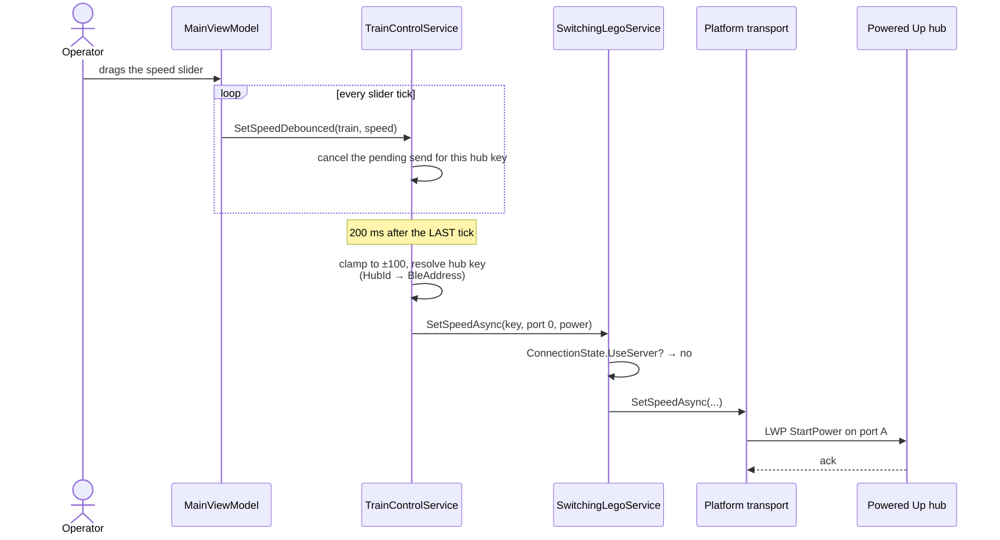
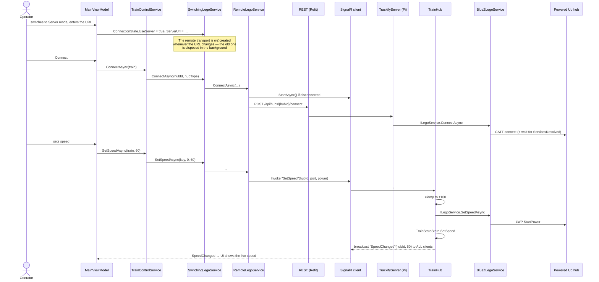
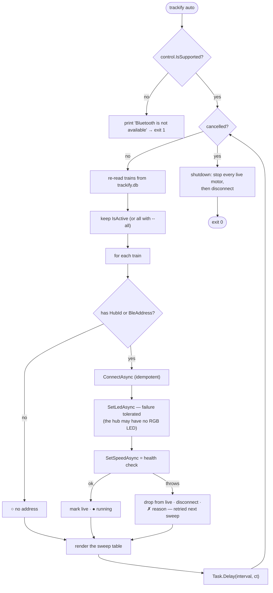
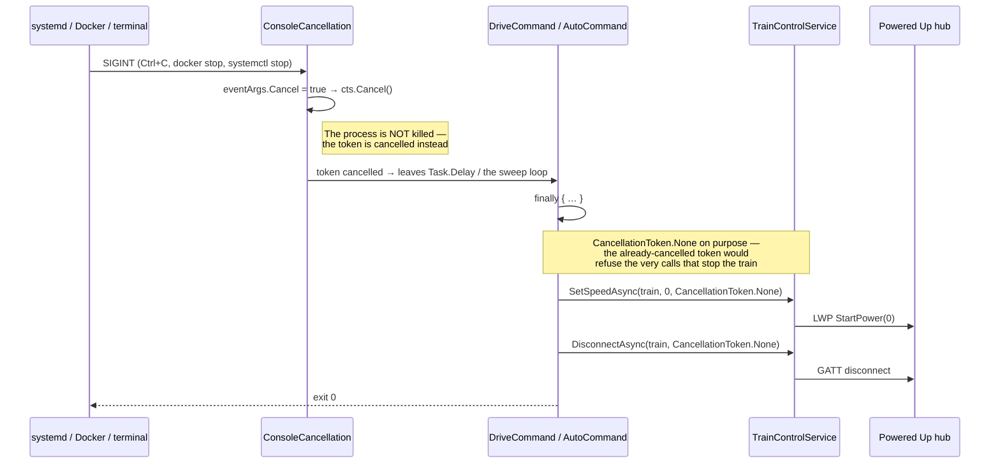

# 6. Runtime View

Five scenarios, chosen because each exercises a different part of the architecture: the BLE seam, the
shared control use-case, the network boundary, unattended operation, and the safety path.

## 6.1 Discovering a hub (Linux/BlueZ)

This is the scenario with the most hard-won detail — four separate BlueZ facts had to be discovered
the hard way ([§2.1 TC-4](02-architecture-constraints.md#21-technical-constraints-not-negotiable)).

```mermaid
sequenceDiagram
    actor Op as Operator
    participant Cmd as DiscoverCommand
    participant Svc as BlueZLegoService
    participant Ad as BlueZPoweredUpBluetoothAdapter
    participant SB as SharpBrick host
    participant BZ as bluetoothd (D-Bus)

    Op->>Cmd: trackify discover --timeout 15
    Cmd->>Svc: DiscoverAsync(ct)
    Note over Svc,Ad: Preflight FIRST — SharpBrick's Discover() is<br/>fire-and-forget, so a radio-off error could<br/>never surface through it
    Svc->>Ad: EnsureReadyAsync()
    Ad->>BZ: GetAdapter / SetPoweredAsync(true)
    alt radio soft-blocked or missing
        BZ-->>Ad: not powered
        Ad-->>Svc: throw (actionable message)
        Svc-->>Op: "…rfkill unblock bluetooth"
    else ready
        Svc->>SB: start discovery
        SB->>Ad: Discover(callback)
        Ad->>BZ: SetDiscoveryFilter(Transport = le)
        Ad->>BZ: GetDevicesAsync()
        Note right of Ad: Already-cached devices are enumerated too —<br/>a fresh StartDiscovery never re-fires<br/>DeviceFound for them
        BZ-->>Ad: cached devices
        Ad->>BZ: StartDiscovery()
        BZ-->>Ad: DeviceFound (advertisement)
        Ad-->>SB: hub + manufacturer data
        SB-->>Svc: hub info
        Svc-->>Cmd: IReadOnlyList&lt;DiscoveredHubDto&gt;
        Cmd-->>Op: table of hubs (id, MAC, type, RSSI)
    end
```

Discovery has **no fixed timeout** in the port contract — it scans until the first hub appears or the
token is cancelled. Callers impose their own bound: the CLI via `--timeout`, the REST endpoint via a
linked `CancellationTokenSource` capped by `Trackify:Server:DiscoverTimeoutSeconds` (default 20).

## 6.2 Driving a train locally (app, Direct mode)



Two details matter here. The debounce is **per hub key**, so two trains being adjusted at once never
cancel each other. And the debounced path is explicitly *best-effort* — if the send fails it is
dropped rather than retried, because the next slider movement will supersede it anyway. A discrete
action (a stop button, a colour change) uses the immediate `SetSpeedAsync`/`SetLedAsync` instead.

## 6.3 Driving a train over the LAN (app in Server mode → Pi)



The server is a **transport substitution, not a different feature set**: `TrainHub` forwards straight
to the same `ILegoService` the app would have used locally. A second client connecting later calls
`GET /api/state` to learn the current speeds without waiting for the next change.

## 6.4 Auto-pilot sweep (`trackify auto`)

The unattended path. Every `--interval` seconds (default 60) it re-reads the store, so trains edited
in the app are picked up without restarting the daemon.



Three deliberate behaviours:

- **A failed sweep does not kill the daemon.** Any non-cancellation exception is printed and the loop
  continues — a transient store read or radio hiccup must not end unattended operation.
- **`SetSpeedAsync` doubles as a liveness probe.** If the link dropped it throws; the train is
  disconnected and removed from `live`, and the next sweep reconnects it fresh.
- **A missing RGB LED is not an error.** `SetLedAsync` failures are swallowed *specifically* here,
  because some hubs have no LED — this is the one narrow exception to the no-silent-catch rule, and
  it is commented as such at the call site.

## 6.5 Clean shutdown (the safety path)

The most important scenario in the system: whatever else happens, a train must not keep moving.



The ordering is not incidental: **stop, then disconnect**. Disconnecting a hub that is still under
power leaves it running on its last command. `docker-compose.yml` therefore sets
`stop_signal: SIGINT` and the systemd unit sets `KillSignal=SIGINT`, so both paths reach this same
`finally` block rather than a `SIGTERM` kill.

## 6.6 Application startup (composition)

| Host | Sequence |
|---|---|
| **CLI** | `appsettings.json` + env → Serilog → `AddTrackifyDomain/Application/Infrastructure(TRACKIFY_STORE)` → `DependencyInjectionRegistrar` bridges DI onto Spectre → `CommandApp<DashboardCommand>` with a global exception handler → `RunAsync(args, ct)` |
| **Backend** | `WebApplication.CreateBuilder` with `ContentRootPath = AppContext.BaseDirectory` (so `appsettings.json` is found under systemd/Docker) → same three layers → `AddTrackifyServer()` → exception-handler middleware → CORS → REST map + `MapHub<TrainHub>` |
| **Uno app** | `App()` installs three global exception hooks (UI, `AppDomain`, unobserved tasks) → `OnLaunched` builds the Uno host → the three layers → `ConnectionState` (seeded from `AppConfig:ServerUrl`) → the last-registered `ILegoService` is rebuilt as the "local" transport and wrapped in `SwitchingLegoService` → `RegisterRoutes` → navigate to `Shell` |

All three composition roots call the same three `AddTrackify*` extensions in the same order. That
symmetry is the point: adding a service to a layer makes it available to every front-end at once.
