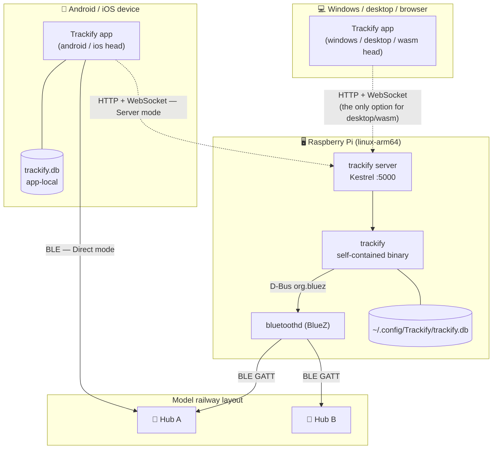
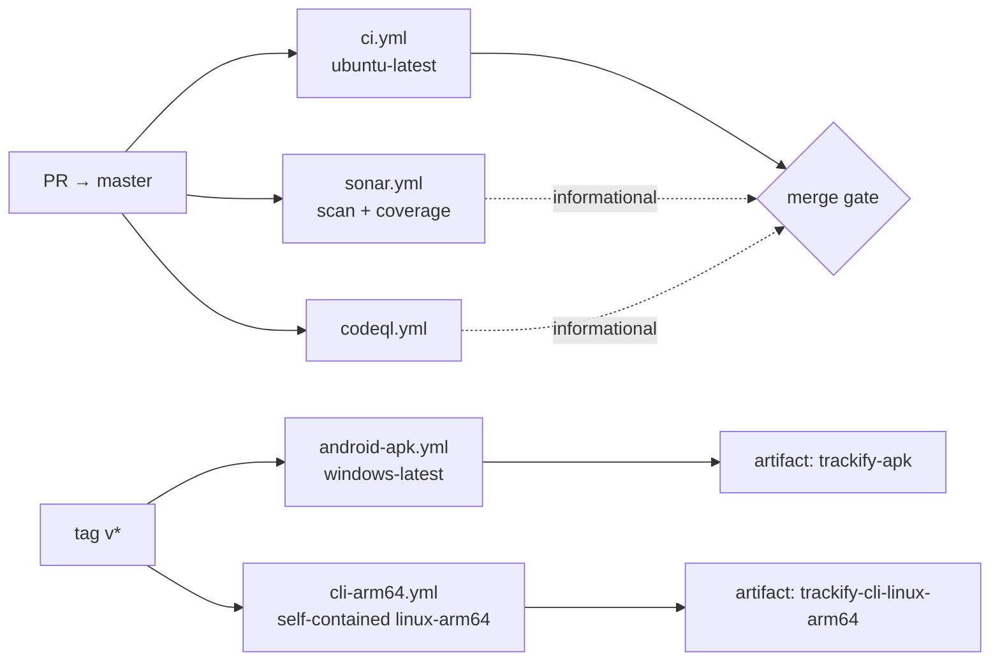

# 7. Deployment View

Trackify has three deployment shapes: **local-only** (one device does everything), **client/server**
(a Pi owns the radio, phones drive it), and **headless** (a Pi runs the layout with nobody watching).
The same artifacts serve all three.

## 7.1 Infrastructure overview



| Node | Runtime | Trackify artifact | Radio |
|---|---|---|---|
| Android device | Android, .NET 10 | `net10.0-android` APK | Plugin.BLE 3.0.0 → Android BLE |
| iOS device | iOS, .NET 10 | `net10.0-ios` (requires a macOS build host) | Plugin.BLE → CoreBluetooth |
| Windows PC | Windows 10 19041+ | `net10.0-windows10.0.19041.0` | SharpBrick `.WinRT` |
| Desktop (Skia) / browser | .NET 10 / WASM | `net10.0-desktop`, `net10.0-browserwasm` | **none** — Server mode only |
| Raspberry Pi / Linux server | linux-arm64 (or x64) | self-contained `trackify` binary | BlueZ via D-Bus |
| Dev Windows box | Windows | CLI `net10.0-windows…` TFM | WinRT — so `discover`/`drive` work while developing |

> **The CLI has two flavours on purpose.** The plain `net10.0` build is what ships to the Pi (BlueZ,
> selected at runtime). On a Windows dev box the project *also* targets `net10.0-windows…`, where the
> `WINDOWS` symbol makes `AddTrackifyApplication` compile in `AddWindowsLego` — so the CLI can drive
> real hubs during development. The plain build reports "Bluetooth is not available" off-Linux.

## 7.2 Raspberry Pi — bare deployment

**Build** (from any OS; no build flags needed, because BlueZ is always compiled in and selected at
runtime):

```bash
dotnet publish Source/Trackify.Cli/Trackify.Cli.csproj -c Release -r linux-arm64 \
  --self-contained -o publish/
scp -r publish/ pi@raspberrypi:/opt/trackify/
ssh pi@raspberrypi 'chmod +x /opt/trackify/trackify'
```

Self-contained means the Pi needs no .NET runtime. The `cli-arm64.yml` workflow produces exactly this
artifact on tag `v*`.

**Prerequisite — BlueZ must be installed and the radio powered.** Raspberry Pi OS usually ships it;
Ubuntu Server images do **not**. The bundled idempotent script does the whole job:

```bash
sudo Source/Trackify.Cli/scripts/setup-bluez.sh
```

It installs `bluez` + `rfkill`, enables and starts `bluetoothd`, clears any soft-block, powers the
adapter, and adds the user to the `bluetooth` group (log out and back in afterwards, or a non-root
`trackify` is denied on D-Bus). `scripts/pi-bt-info.sh` is a read-only checker for when discovery
still misbehaves.

**Autostart** — `/etc/systemd/system/trackify.service`:

```ini
[Unit]
Description=Trackify LEGO train control
After=bluetooth.target
Requires=bluetooth.service

[Service]
ExecStart=/opt/trackify/trackify auto --interval 60
Restart=on-failure
RestartSec=5
User=pi
Environment=TRACKIFY_STORE=/home/pi/.config/Trackify/trackify.db
KillSignal=SIGINT

[Install]
WantedBy=multi-user.target
```

`KillSignal=SIGINT` is load-bearing — it routes `systemctl stop` into the clean-shutdown path in
[§6.5](06-runtime-view.md#65-clean-shutdown-the-safety-path) instead of killing the process with a
train still moving. Use `ExecStart=… auto` for the whole fleet or `… drive "Blauer Zug" --speed 40`
for a single train.

## 7.3 Raspberry Pi — Docker

```bash
docker compose up -d                       # build + run, restarts after reboot
docker compose logs -f                     # live Serilog output
docker compose run --rm trackify discover  # one-shot commands
docker compose down                        # stops the train cleanly (SIGINT)
```

A container has no radio of its own, so `docker-compose.yml` makes three specific concessions:

| Setting | Why |
|---|---|
| `network_mode: host` | BLE goes through the **host's** `bluetoothd`; a bridge network would isolate it |
| `volumes: /var/run/dbus:/var/run/dbus` | D-Bus socket access to `org.bluez` on the host |
| `stop_signal: SIGINT` | `docker stop` must reach the clean-shutdown path, not `SIGTERM`-kill a moving train |
| `restart: unless-stopped` | Survives reboots |

The image runs as root — SonarCloud's `docker:S6471` is suppressed for this Dockerfile only, with the
reason (host BlueZ D-Bus access + a bind-mounted store) documented in the Dockerfile itself.

## 7.4 Server mode (client/server)

On the Pi:

```bash
trackify server --urls http://0.0.0.0:5000
```

The bind address comes from `appsettings.json` (`"Urls": "http://0.0.0.0:5000"`) unless `--urls`
overrides it. `Trackify:Server:DiscoverTimeoutSeconds` (default 20) caps how long a `POST
/api/discover` may scan.

In the app: switch to **Server mode** and enter `http://<pi-ip>:5000`. The setting persists in local
app settings, so it survives a restart; `RemoteTrainSync` then pulls the Pi's trains into the app's
local SQLite store, de-duplicating by hub identity (`HubId` → `BleAddress` → `Name`).

**Trust boundary.** The backend has no authentication, no TLS, and permissive CORS (deliberately
without credentials, avoiding the unsafe any-origin + `AllowCredentials` combination). It is designed
for a **trusted home LAN** and must not be exposed to the internet — see
[ADR-15](09-architecture-decisions.md#adr-15-no-authentication-or-tls-on-the-lan-backend) and
[§11](11-risks-and-technical-debt.md).

## 7.5 Data placement

| Data | Location | Notes |
|---|---|---|
| Train configuration | `~/.config/Trackify/trackify.db` (Linux) · `%APPDATA%\Trackify\trackify.db` (Windows) | Overridable with `TRACKIFY_STORE`. Schema created by `EnsureCreated()`; enums stored as readable names |
| App/CLI on one machine | Same file — they share the schema | Copy the `.db` to the Pi, or point both at one path |
| App in Server mode | Its own local store, refreshed by `RemoteTrainSync` | The Pi remains the source of truth while in Server mode |
| Last-known speeds | `TrainStateStore`, **in memory only** | Lost when the server restarts; by design, since real hub state is re-established on reconnect |
| Logs | stdout (Serilog console sink) → `journalctl -u trackify` or `docker compose logs` | Levels and sinks configured in `appsettings.json` |

## 7.6 Build and delivery pipeline



| Workflow | Trigger | Runner | Does |
|---|---|---|---|
| `ci.yml` | PR / push to `master` | ubuntu-latest | Builds the CLI + shared core, runs the tests. **The pre-merge gate** |
| `sonar.yml` | PR / push to `master` | ubuntu-latest | SonarCloud scan with coverage (OpenCover via coverlet). Deliberately separate from the gate so a Sonar outage cannot block a merge; skipped for fork PRs, which never receive `SONAR_TOKEN` |
| `codeql.yml` | PR / push | — | Security code scanning |
| `android-apk.yml` | tag `v*` / manual | windows-latest | JDK 17 + `android` workload, `-f net10.0-android` → `trackify-apk` |
| `cli-arm64.yml` | tag `v*` / manual | ubuntu-latest | `-f net10.0 -r linux-arm64 --self-contained` → `trackify-cli-linux-arm64` |

All workflows provision the .NET 8, 9 and 10 SDKs; `global.json` pins `9.0.100` with
`rollForward: latestMajor`, so the newest installed major is used.

**The Uno app is intentionally not built by `ci.yml`.** Its five heads trigger workload imports and
OS-locked TFMs (iOS needs macOS, Windows needs Windows) during *restore*, even with `-f <head>` — so
gating one head reliably would need a per-OS + workload matrix. The Android head is covered by
`android-apk.yml`; the remaining heads are verified locally. The same limitation scopes the
SonarCloud analysis to the shared core + CLI + tests. → [§11](11-risks-and-technical-debt.md)

**Local verification** (what a change is expected to pass before it is pushed):

```bash
dotnet build Source/Trackify.Cli/Trackify.Cli.csproj
dotnet test  Test/Trackify.Tests/Trackify.Tests.csproj
dotnet build Source/Trackify/Trackify.csproj -f net10.0-desktop
dotnet run --project Source/Trackify/Trackify.csproj -f net10.0-desktop   # launch smoke test
```

Buildable heads outside macOS: `net10.0-android`, `net10.0-desktop`, `net10.0-browserwasm`,
`net10.0-windows10.0.19041.0`. Real BLE behaviour is confirmed on a device and on a Pi — it cannot be
exercised in CI.
