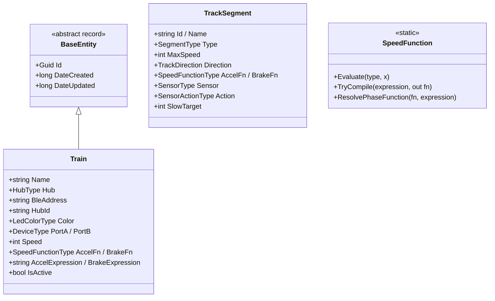

# 8. Crosscutting Concepts

Concepts that apply across several building blocks. Each one is stated as the rule, the reason, and
where it lives.

## 8.1 Domain model

The domain is deliberately thin — it is *configuration plus maths*, not a simulation.



Two rules give this model its shape:

1. **Runtime state is not domain state.** `Train` has no `IsConnected`, no status text, no current
   speed. Connection state belongs to the control/presentation layer, which is why the same entity
   can be shared by a phone and a headless daemon.
2. **Presentation output is not domain output.** `SpeedFunction` computes `f(x)`; the SVG path that
   draws it (`Helpers/SpeedCurve` → `SpeedProfileGraph`) lives in the app. Likewise `TrackSegment`
   carries no geometry and no German labels.

`SpeedFunction.TryCompile` validates a user formula by probing it at x = 0, 0.5 and 1 and rejecting
NaN/∞; `ResolvePhaseFunction` falls back to the identity function when a custom expression is
invalid, so a typo degrades to linear rather than throwing mid-drive.

## 8.2 Dependency injection and composition

Every layer exposes exactly one registration extension, and a composition root chains them in order:

| Extension | Registers |
|---|---|
| `AddTrackifyDomain()` | Nothing — the Domain is pure. It exists for symmetry so every layer is called in one place |
| `AddTrackifyApplication()` | `ITrainControlService`, `ITrainService`, and — filtered by `#if` — `AddAndroidLego` / `AddIosLego` / `AddWindowsLego` |
| `AddTrackifyInfrastructure(storePath?)` | The SQLite `DbContextFactory` + `ITrainRepository`, and `AddLinuxLego()` (runtime-checked) |

Consequences worth knowing:

- The **plain `net10.0` flavour registers no transport at all** from Application. The CLI gets BlueZ
  from Infrastructure; desktop/WASM heads get a no-op registered by the app.
- `AddTrackifyInfrastructure` creates the store directory before registering the context factory, so
  a first run on a fresh Pi does not fail on a missing `~/.config/Trackify`.
- `AddLinuxLego` registers the **concrete** `BlueZPoweredUpBluetoothAdapter` as a singleton *and* a
  factory forwarding `IPoweredUpBluetoothAdapter` to the same instance — so the SharpBrick host and
  `BlueZLegoService` share one radio. The service needs the concrete type because
  `EnsureReadyAsync()` is not on SharpBrick's interface.
- The Uno app performs one extra step: it takes the last-registered `ILegoService` descriptor,
  rebuilds it as the "local" transport, and registers `SwitchingLegoService` in its place — so the two
  never compete for the same resolution.

## 8.3 The DTO boundary

Front-ends work with `TrainDto`, never with the `Train` entity.

```
Domain.Train  ←(ToEntity)—  Application.TrainDto  —(ToDto)→  front-ends
```

`TrainDto` carries the configuration fields a front-end reads or edits; persistence audit fields
(`DateCreated`/`DateUpdated`) stay on the entity. The rule is enforced —
`Cli_never_touches_the_domain_entity_namespace` fails the build on a wrong `using`, and the test
project references the CLI *solely* so this rule is checkable.

Why bother in a solo project: it keeps persistence changes (adding an audit column, changing the key
strategy) from rippling into two front-ends, and it makes the network contract obvious — `TrainDto`
is literally what `GET /api/trains` returns.

## 8.4 Persistence

| Concept | Decision |
|---|---|
| Store | SQLite file via EF Core (`Microsoft.EntityFrameworkCore.Sqlite` 9.x, consumable from net10) |
| Location | `~/.config/Trackify/trackify.db` · `%APPDATA%\Trackify\trackify.db`; `TRACKIFY_STORE` overrides |
| Schema creation | `EnsureCreated()` — **no migrations** |
| Entity purity | The Domain entity carries **no EF attributes**; all mapping is fluent in `TrackifyDbContext` |
| Enum storage | Stored as **readable names**, via a `ConfigureConventions` convention over `Properties<Enum>()` — so the file stays hand-inspectable |
| Keys | GUID v7 (`Guid.CreateVersion7()`) — time-ordered, so index locality is decent without a sequence |
| Access pattern | `IDbContextFactory` + a generic `BaseRepository<T>`; per-entity ports extend `IBaseRepository<T>` |

**The `EnsureCreated` trap:** it will not migrate an existing file. Changing an entity's shape means
deleting the dev `trackify.db` (or introducing EF migrations). This is a deliberate trade for a
single-user hobby store — see [§11](11-risks-and-technical-debt.md).

## 8.5 Logging

High-performance, source-generated logging with a Serilog backend:

- Each project that logs has an `internal static partial class Log` (`Log.cs`) holding
  `[LoggerMessage]` declarations with explicit, per-project `EventId` ranges.
- Call sites take an **injected `ILogger`**. `ILogger<T>` is a *required* constructor dependency —
  every composition root registers logging, DI factories use `GetRequiredService`, and tests pass
  `NullLogger<T>.Instance` explicitly rather than making the parameter optional.
- **The Domain does not log.** It has no logging dependency at all (arch-test enforced).
- Levels and sinks come from `appsettings.json` (`Serilog` section). The Console sink assembly is
  passed **explicitly** to `ReadFrom.Configuration` — in a single-file publish (the Pi deploy) Serilog
  cannot scan the app directory for sink assemblies, and configuration binding would silently produce
  no output.
- The app additionally downgrades `Microsoft` and `Uno` to Warning so framework noise does not bury
  Trackify's own Information logs.

**Log injection is treated as a real concern**: the backend's exception handler sanitizes CR/LF out of
user-controlled request values (method, path) before logging them, so a crafted request cannot forge
log lines (CWE-117).

## 8.6 Error handling

The standard is: **never fail silently.** Log and return a failure, or rethrow — no empty `catch`.

Each host installs a global handler, ASP.NET-style, so nothing escapes unlogged:

| Host | Mechanism |
|---|---|
| CLI | `config.SetExceptionHandler(...)` — logs the exception, prints `✗ Error: <message>`, returns exit code 1 |
| Backend | `app.UseExceptionHandler(...)` — logs with sanitized request data, responds `500` with a **generic** JSON body (never internal detail — CWE-209) |
| Uno app | Three hooks in `App()`: `UnhandledException` (handled, so the app stays alive), `AppDomain.CurrentDomain.UnhandledException`, and `TaskScheduler.UnobservedTaskException` |

There are exactly three deliberate swallow sites, each commented at the call site:

1. **Debounced speed sends** — best-effort by design; the next slider movement supersedes a failure.
2. **`SetLedAsync` in the auto-pilot sweep** — some hubs have no RGB LED, so a failure is expected.
3. **Shutdown paths** — stopping and disconnecting are best-effort; one failing train must not
   prevent the others from stopping.

**Cancellation is not an error.** `OperationCanceledException` is rethrown, never caught as a
failure, so the auto-pilot's "survive a bad sweep" behaviour cannot accidentally swallow a shutdown.
Conversely, shutdown work deliberately uses `CancellationToken.None` — the already-cancelled token
would refuse the very calls that stop the train.

## 8.7 Configuration

Nothing is hardcoded; everything comes from `appsettings.json` + environment + args.

| Setting | Source | Default |
|---|---|---|
| Store path | `TRACKIFY_STORE` env var | Per-OS user config path |
| Log levels / sinks | `appsettings.json` → `Serilog` | Information; `Microsoft*` at Warning |
| Backend bind address | `appsettings.json` → `Urls`, or `--urls` | `http://0.0.0.0:5000` |
| Discovery cap (REST) | `appsettings.json` → `Trackify:Server:DiscoverTimeoutSeconds` | 20 s |
| App's default server URL | Uno config → `AppConfig:ServerUrl` | empty (Direct mode) |
| App's mode + URL | `ApplicationData.Current.LocalSettings` | persisted per device |

The CLI and the backend both set the configuration base path to `AppContext.BaseDirectory`, so
`appsettings.json` is found when launched from another working directory (systemd, Docker).

## 8.8 The network contract

`ApiRoutes` and `TrainHubMethods` live in **`Trackify.Application`** and are compiled into both
sides. Refit attributes on `ITrackifyApi` reference the same constants the server passes to
`MapGet`/`MapPost`, and `TrainHubMethods.SetSpeed` is `nameof(SetSpeed)` — so a renamed hub method is
a compile error, not a runtime "method not found".

Wire conventions: enums serialize as **names** (`JsonStringEnumConverter`, matching the store); control
routes are keyed by `hubId` so they map 1:1 onto `ILegoService`; speed is clamped server-side as well
as client-side.

## 8.9 User interface concepts (Uno app)

| Concept | Rule |
|---|---|
| Pattern | MVVM with CommunityToolkit.Mvvm — field-based `[ObservableProperty]` and `[RelayCommand]` (`MVVMTK0045` partial-property advice is intentionally suppressed) |
| Navigation | Uno.Extensions Navigation; routes and ViewMaps registered in `App.xaml.cs` → `RegisterRoutes` |
| Code-behind | None beyond `InitializeComponent()`, except the responsive master–detail layout in `MainPage.xaml.cs`. Use attached behaviors (`TappedCommandBehavior`) instead of `*_Tapped` handlers |
| Components vs. Widgets | `Components/` = page-specific sections inheriting the page `DataContext`. `Widgets/` = reusable atoms exposing `DependencyProperty`s |
| Converters | Registered **once** globally in `Styles/Converters.xaml`; never re-declared per page. Tokens in `Styles/DesignTokens.xaml` |
| Design-time data | Classic `{Binding}` views carry `d:DataContext="{d:DesignInstance …}"` with `mc:Ignorable="d"` |
| Language | German labels and user-facing errors |
| Mobile safe area | `utu:SafeArea.Insets` from the Uno Toolkit — `Top` on the page header, `Bottom` on content, so status bars and gesture navigation never overlap. Apply the same to any new mobile screen |

## 8.10 Testing

`Trackify.Tests` is foldered by layer — `Domain/`, `Application/`, `Infrastructure/`, `Cli/`,
`Architecture/` — with reusable doubles in `Fakes/` (`FakeLegoService`, `FakeTrainRepository`).
Internal CLI helpers are reachable via `InternalsVisibleTo`.

What is testable and what is not:

| Testable in CI | Verified only on hardware |
|---|---|
| Speed-function maths and the expression parser | Any real BLE behaviour (discovery, connect, GATT) |
| `TrainControlService` over a fake `ILegoService` | Uno UI rendering (the Skia surface cannot be screenshotted in an agent environment) |
| SQLite repository round-trips | iOS builds (need a macOS host) |
| CLI helpers (`TrainStateStore`) | |
| **The layer dependency rules themselves** (NetArchTest) | |

The test project deliberately opts out of `TreatWarningsAsErrors` and `EnforceCodeStyleInBuild` —
the xUnit analyzers are strict enough to make that combination hostile.

## 8.11 Security concepts

| Concern | Treatment |
|---|---|
| Trust boundary | The LAN backend trusts its network segment: no auth, no TLS, permissive CORS **without** credentials (avoiding the unsafe any-origin + `AllowCredentials` pairing, CWE-942) |
| Error disclosure | The backend returns a generic 500 body; internal exception detail never reaches a client (CWE-209) |
| Log forging | CR/LF stripped from user-controlled values before logging (CWE-117) |
| Static analysis | SonarCloud + CodeQL on every PR; suppressions are per-site and carry a written reason |
| Known advisory | `Tmds.DBus` 0.15.0 (`GHSA-xrw6-gwf8-vvr9`) arrives transitively via `Linux.Bluetooth`; `NU1903` is suppressed in Infrastructure, the CLI and the app, accepted because BlueZ is only ever exercised on a trusted local Pi. See [§11](11-risks-and-technical-debt.md) |
| Secrets | None. Trackify stores no credentials and makes no authenticated outbound calls |
