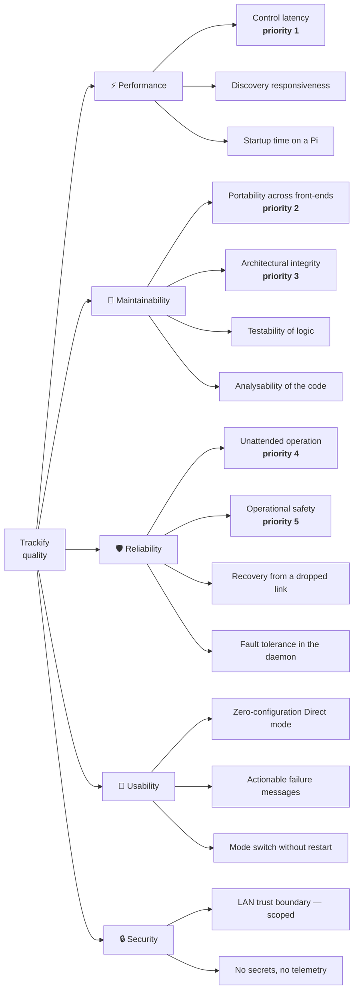

# 10. Quality Requirements

## 10.1 Quality Tree

## 10.2 Quality Scenarios

Scenarios are written as *stimulus → expected response*. **U** = usage scenario, **C** = change
scenario. The mechanism column names what actually delivers it, so a regression has an obvious
suspect.

### Performance

| ID | Scenario | Expected response | Mechanism |
|---|---|---|---|
| **P1** (U) | The operator drags the speed slider through 30 intermediate values in one second | Exactly **one** command reaches the hub, ~200 ms after the drag ends; the train responds without perceptible lag | Per-hub-key debounce in `TrainControlService.SetSpeedDebounced`; intermediate sends are cancelled, not queued |
| **P2** (U) | The operator taps Stop | The motor stops on the **immediate** path — no debounce delay | Discrete actions call `SetSpeedAsync`, not the debounced variant |
| **P3** (U) | A speed change is made in Server mode over the LAN | The command travels over an already-open WebSocket; no HTTP handshake per change; every connected client sees the new speed | SignalR `SetSpeed` + `SpeedChanged` broadcast ([ADR-08](09-architecture-decisions.md#adr-08-rest-for-one-shot-actions-signalr-for-real-time-control)) |
| **P4** (U) | `POST /api/discover` is called and no hub is powered on | The request returns after at most `Trackify:Server:DiscoverTimeoutSeconds` (default 20) — it never hangs | Linked `CancellationTokenSource` with `CancelAfter` in `TrackifyServer.MapApi` |
| **P5** (U) | Two trains are adjusted simultaneously | Neither train's pending command cancels the other's | The debounce dictionary is keyed by hub key |

### Maintainability

| ID | Scenario | Expected response | Mechanism |
|---|---|---|---|
| **M1** (C) | A new hub-control capability is added (e.g. a second motor port) | It is implemented **once** in `TrainControlService`/`ILegoService` and appears in both front-ends; no front-end duplicates control logic | The `ILegoService` seam + shared use-case ([ADR-03](09-architecture-decisions.md#adr-03-ilegoservice-as-the-single-ble-seam)) |
| **M2** (C) | A developer adds `using Trackify.Infrastructure…` inside `Trackify.Application` | **CI fails** with a named offending type, before review | `LayerTrainDependencyTests` (NetArchTest) |
| **M3** (C) | A developer puts a class in a folder whose namespace does not match | **The build fails** (`IDE0130` is an error), locally and in CI | `EnforceCodeStyleInBuild` in `Directory.Build.props` |
| **M4** (C) | A front-end starts using the `Train` entity instead of `TrainDto` | **CI fails** — the DTO boundary is asserted | `Cli_never_touches_the_domain_entity_namespace` |
| **M5** (C) | A new BLE platform must be supported | Only a new `ILegoService` implementation and an `Add…Lego` extension are needed; nothing above the seam changes | Per-layer DI + the transport-selection pattern ([ADR-04](09-architecture-decisions.md#adr-04-two-transport-selection-styles-runtime-vs-compile-time)) |
| **M6** (C) | A package version is bumped in a `.csproj` instead of `Directory.Packages.props` | Build error — versions are managed centrally | Central Package Management |
| **M7** (C) | New speed-curve maths is added | It is unit-testable without hardware, a UI, or a database | `SpeedFunction` is pure and dependency-free ([§8.1](08-crosscutting-concepts.md#81-domain-model)) |

### Reliability

| ID | Scenario | Expected response | Mechanism |
|---|---|---|---|
| **R1** (U) | A hub's BLE link drops during unattended operation | The next sweep (≤ `--interval`, default 60 s) detects it, disconnects cleanly, and reconnects — without operator action | `AutoCommand`: `SetSpeedAsync` doubles as a liveness probe; failures drop the train from `live` and it is retried |
| **R2** (U) | A store read fails transiently mid-sweep | The daemon prints the failure and **continues**; it does not exit | The sweep's non-cancellation `catch` in `AutoCommand.ExecuteAsync` |
| **R3** (U) | `systemctl stop trackify` while a train is moving | The motor is stopped **first**, then the hub disconnected; the process exits 0 | `KillSignal=SIGINT` → `ConsoleCancellation` → `finally` block using `CancellationToken.None` ([§6.5](06-runtime-view.md#65-clean-shutdown-the-safety-path)) |
| **R4** (U) | `docker compose down` while a train is moving | Same as R3 | `stop_signal: SIGINT` in `docker-compose.yml` |
| **R5** (U) | The Pi loses power and reboots | `trackify` restarts automatically and re-applies every active train's saved configuration | systemd `Restart=on-failure` + `WantedBy=multi-user.target`, or Docker `restart: unless-stopped` |
| **R6** (U) | A hub has no RGB LED | Driving still works; the LED failure does not abort the sweep | Narrow, commented catch around `SetLedAsync` in `AutoCommand.ApplyAsync` |
| **R7** (U) | SharpBrick's connect null-deref fires | The connect is retried a bounded number of times and succeeds | [ADR-14](09-architecture-decisions.md#adr-14-bounded-connect-retry-around-a-sharpbrick-null-deref) |
| **R8** (U) | An unexpected exception escapes anywhere | It is **logged** and surfaced — a non-zero exit + message (CLI), a generic 500 (backend), a logged error with the app still alive (Uno) | Global exception handlers in all three hosts ([§8.6](08-crosscutting-concepts.md#86-error-handling)) |
| **R9** (C) | Trains are edited in the app while the daemon runs | Changes are picked up on the next sweep; no daemon restart is needed | `AutoCommand` re-reads the store every cycle |

### Usability

| ID | Scenario | Expected response | Mechanism |
|---|---|---|---|
| **U1** (U) | A first-time user installs the app and powers on a hub | Discovery finds it and a train can be saved with no server, no account and no configuration | Local-first design; store auto-created on first run |
| **U2** (U) | The operator switches from Direct to Server mode | The switch takes effect on the next command — **no restart**; the setting survives an app restart | `SwitchingLegoService` + `ConnectionState` persisted in local app settings ([ADR-09](09-architecture-decisions.md#adr-09-runtime-directserver-switch-instead-of-a-restart)) |
| **U3** (U) | The Pi's Bluetooth radio is soft-blocked by `rfkill` | The error names the actual fix rather than surfacing a null reference | `BlueZPoweredUpBluetoothAdapter.EnsureReadyAsync` is awaited **before** the fire-and-forget scan starts |
| **U4** (U) | Server mode is selected but no URL is entered | A clear German message asks for a server address; nothing throws obscurely | Explicit guards in `SwitchingLegoService.Active()` |
| **U5** (U) | The user enters an invalid custom speed formula | It degrades to a linear curve instead of throwing mid-drive | `SpeedFunction.ResolvePhaseFunction` fallback |
| **U6** (U) | The app runs on a phone with a notch and gesture navigation | System bars never overlap content | Uno Toolkit `utu:SafeArea.Insets` (Top on the header, Bottom on content) |

### Security

| ID | Scenario | Expected response | Mechanism |
|---|---|---|---|
| **S1** (U) | A request to the backend throws | The client receives a **generic** 500 body; no stack trace or internal detail leaks (CWE-209) | `UseExceptionHandler` in `TrackifyServer` |
| **S2** (U) | A request arrives with CR/LF in its path | Log output cannot be forged (CWE-117) | `Sanitize()` before logging request method/path |
| **S3** (U) | A browser (WASM head) calls the API cross-origin | The call is allowed, but **without credentials** — avoiding the unsafe any-origin + `AllowCredentials` pairing (CWE-942) | `AddTrackifyServer()` CORS policy |
| **S4** | Someone else is on the same LAN | **They can drive the trains.** This is an accepted, documented limitation of the trust boundary — not a defect | [ADR-15](09-architecture-decisions.md#adr-15-no-authentication-or-tls-on-the-lan-backend); see [§11](11-risks-and-technical-debt.md) |

## 10.3 How quality is currently measured

| Aspect | Measured by | Where |
|---|---|---|
| Build health, warnings, code style | `TreatWarningsAsErrors` + `EnforceCodeStyleInBuild` | every build |
| Layer integrity | NetArchTest architecture tests | `ci.yml` |
| Logic correctness | xUnit tests foldered by layer | `ci.yml` |
| Coverage, bugs, security & maintainability rating | SonarCloud (coverlet → OpenCover) | `sonar.yml`, badges in the README |
| Security patterns | CodeQL | `codeql.yml` |
| Control latency, BLE behaviour, UI rendering | **Manual, on real hardware** | phone + Raspberry Pi |

The last row is the honest gap: the top-priority quality goal (control responsiveness) has **no
automated measurement**, because BLE cannot run in CI. It is verified by feel on a real layout.
